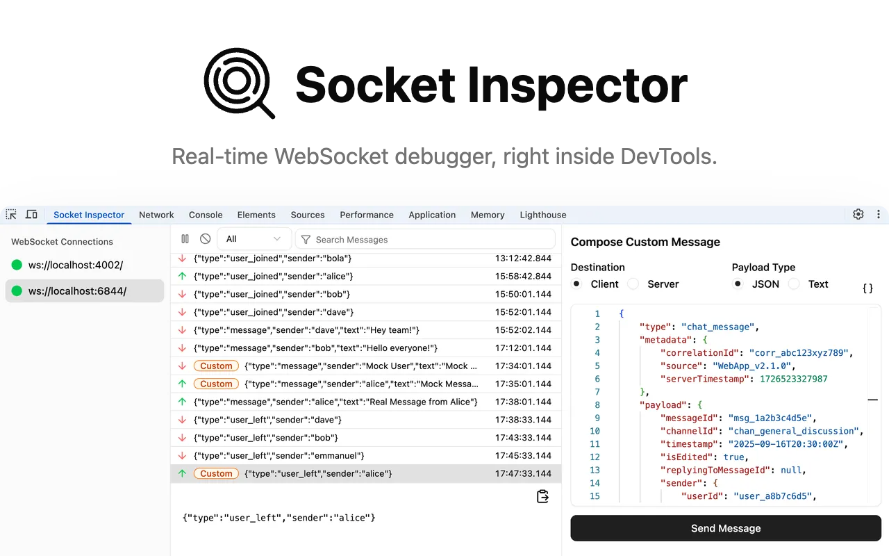

## About

**Socket Inspector** is Chrome DevTools extension for debugging WebSocket applications.

Similar to Chrome’s native DevTools, Socket Inspector allows the user to inspect the page’s WebSocket connections, along with the incoming/outgoing messages for each connection.

It also adds some powerful features such as [sending custom messages](https://socketinspector.com/docs/send-custom-messages/) and [simulating server disconnections](https://socketinspector.com/docs/simulate-server-disconnections/), enabling the user to simulate scenarios that can be difficult to reproduce manually.

## Installation

Chrome Web Store:

- Navigate to the [Chrome store page](https://chromewebstore.google.com/detail/kecipkncnnofappfmapgmfailmnbaoaf?utm_source=item-share-cb)
- Click **Add to Chrome**

## Documentation

Check out the [documentation site](https://socketinspector.com/docs/)

## Support

Bug reports, feature requests, and general questions are welcome and appreciated!

[Submit a GitHub issue](https://github.com/Socket-Inspector/Socket-Inspector/issues/new/choose) or send us an email at support@socketinspector.com
